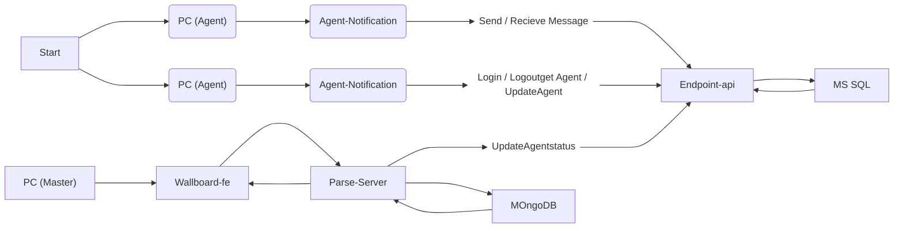

# 🚀 **team02-engce301**

## 📝 **Project Overview**

โครงงานรายวิชา **ENGCE301**  
**การออกแบบและพัฒนาซอฟต์แวร์** _(Software Design and Development)_  
ภาควิชาวิศวกรรมคอมพิวเตอร์ คณะวิศวกรรมศาสตร์  
มหาวิทยาลัยเทคโนโลยีราชมงคลล้านนา เชียงใหม่  
ภาคการศึกษาที่ 2 ปีการศึกษา 2567  

##  **API Specification**
- Endpoint API
  - [/api/v1/login](./endpoint-api/login.md)
  - [/api/v1/logout](./endpoint-api/logout.md)
  - [/api/v1/postOnlineAgentStatus](./endpoint-api/postOnlineAgentStatus.md)
  - [/api/v1/postSendMessage](./endpoint-api/postSendMessage.md)

- Parse server
  - [/hello](./parse-server/hello.md)
  - [/OnlineAgentByAgentCode](./parse-server/OnlineAgentByAgentCode.md)
  - [/postOnlineAgentListByTeam](./parse-server/postOnlineAgentListByTeam.md)
  - [/getUserLoginHistories](./parse-server/getUserLoginHistories.md)
  - [/getAgentStatusHistories](./parse-server/getAgentStatusHistories.md)
  - [/getAgentMessageHistories](./parse-server/getAgentMessageHistories.md)

## Test Case Overview
รอต่อไป~

## Data Flow Diagrams

     
    
     

## **Activity Flow Diagram**

## 👨🏻‍💻 **Members**

| 👤 **ชื่อ - นามสกุล**            | 🎓 **รหัสนักศึกษา** |
| -------------------------------- | ------------------- |
| **นายกรณ์ดนัย ศรีสุริยานุรักษ์** | `65543206001-1`     |
| **นายณัฐภัทร สุระธง**            | `65543206012-8`     |
| **นายกฤษฎา วิริยา**              | `65543206041-7`     |
| **นายสุขสันต์ คำยา**             | `65543206084-7`     |
