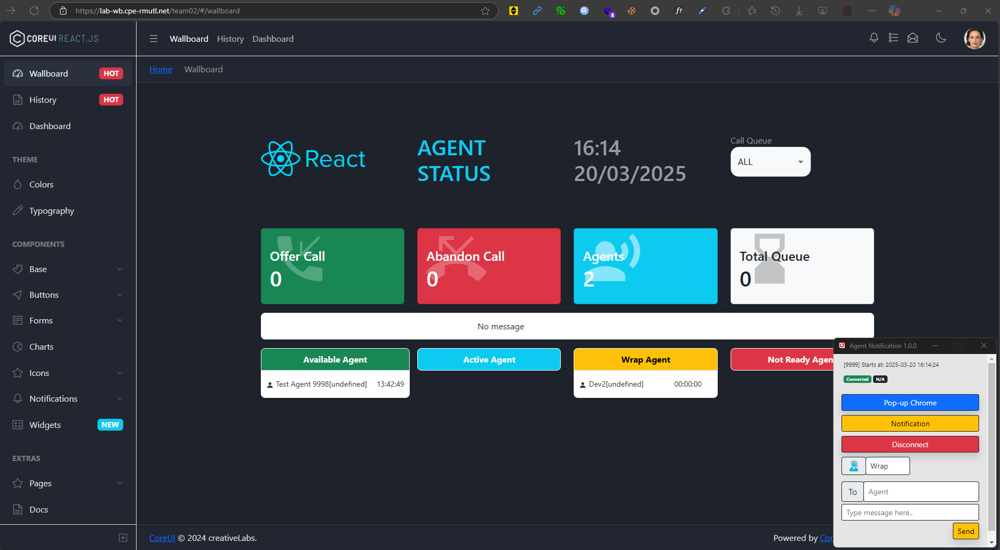
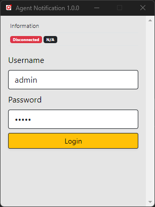
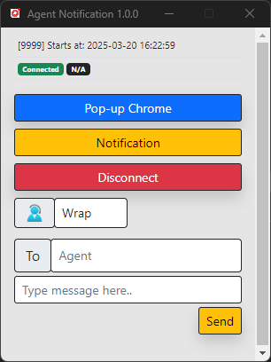
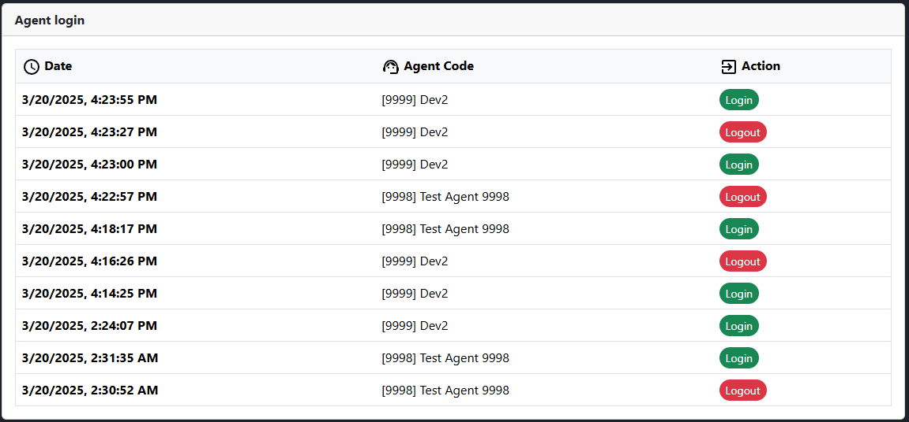
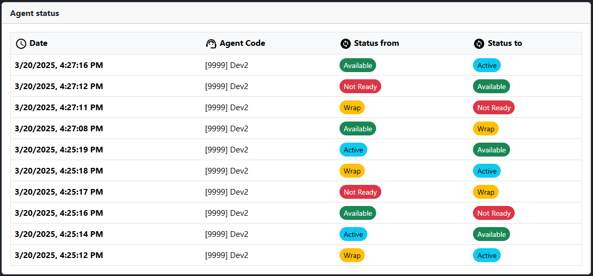
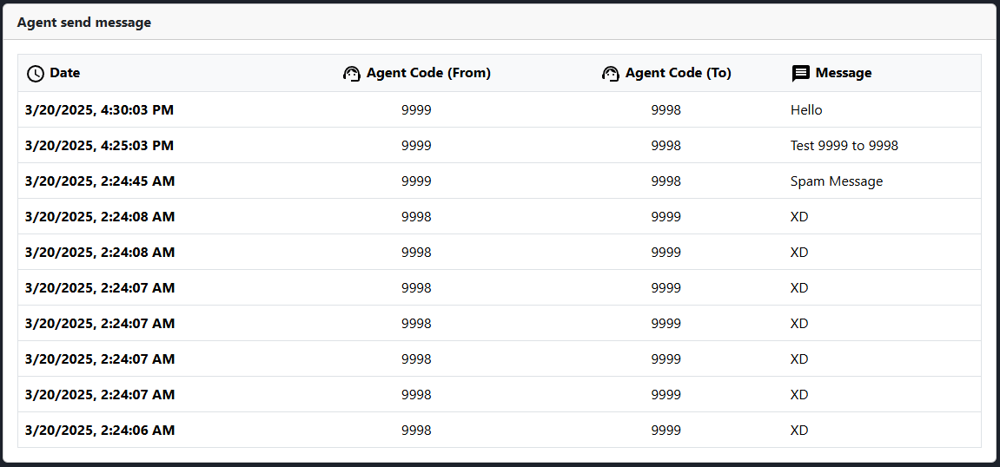

# 🚀 **team02-engce301**

## 📋 **Table of Contents**

- [Project Overview](#-project-overview)
- [Features](#-features)
  - [Agent Notification System](#1-agent-notification-system-)
  - [Agent Wallboard System](#2-agent-wallboard-system-)
- [Screenshots](#-screenshots)
- [API Specification](#-api-specification)
- [System Architecture](#-system-architecture)
- [Test Case Overview](#-test-case-overview)
- [Members](#-members)
- [Project Link](#-project-link) or [Click Me!](https://lab-wb.cpe-rmutl.net/team02/#/wallboard)

## 📝 **Project Overview**

โครงงานรายวิชา **ENGCE301**
**การออกแบบและพัฒนาซอฟต์แวร์** _(Software Design and Development)_
ภาควิชาวิศวกรรมคอมพิวเตอร์ คณะวิศวกรรมศาสตร์
มหาวิทยาลัยเทคโนโลยีราชมงคลล้านนา เชียงใหม่
ภาคการศึกษาที่ 2 ปีการศึกษา 2567

## 🎯 **Features**

### 1. Agent Notification System 🔔

| Feature ID | Description                                                                     |
| ---------- | ------------------------------------------------------------------------------- |
| **R1.1**   | Agent สามารถ Login โดยใช้ Password ได้ โดยถ้า Password ผิดจะไม่สามารถ login ได้ |
| **R1.2**   | สามารถเก็บประวัติการ login และ logout ได้ ในรูปแบบของวันเวลาที่ Login/Logout    |
| **R1.3**   | สามารถเก็บประวัติการเปลี่ยนสถานะเวลาเริ่มต้นและสิ้นสุดแต่ละสถานะได้             |
| **R1.4**   | สามารถเก็บประวัติการพูดคุยของแต่ละ Agent ได้                                    |

### 2. Agent Wallboard System 🖥️

| Feature ID | Description                                                            |
| ---------- | ---------------------------------------------------------------------- |
| **R2.1**   | สามารถแสดง Banner ที่ wallboard รวมทุก Agent ได้                       |
| **R2.2**   | สามารถแสดงประวัติการ login logout และการเปลี่ยนสถานะของแต่ละ Agent ได้ |
| **R2.3**   | สามารถแสดงประวัติการพูดคุยของแต่ละ Agent ได้                           |

## 📸 **Screenshots**

### System Overview

### Feature Demonstrations

- `R1.1` - Agent Login

  
  

- `R1.2` and `R2.2`- Login & Logout History

- `R1.3` and `R2.2` - Status Change History

- `R1.4` and `R2.3` - Agent Message History

## 🔗 **API Specification**

### Endpoint API

- [/api/v1/login](./docs/api/endpoint-api/login.md)
- [/api/v1/logout](./docs/api/endpoint-api/logout.md)
- [/api/v1/postOnlineAgentStatus](./docs/api/endpoint-api/postOnlineAgentStatus.md)
- [/api/v1/postSendMessage](./docs/api/endpoint-api/postSendMessage.md)

### Parse server

- [/hello](./docs/api/parse-server/hello.md)
- [/OnlineAgentByAgentCode](./docs/api/parse-server/OnlineAgentByAgentCode.md)
- [/postOnlineAgentListByTeam](./docs/api/parse-server/postOnlineAgentListByTeam.md)
- [/getUserLoginHistories](./docs/api/parse-server/getUserLoginHistories.md)
- [/getAgentStatusHistories](./docs/api/parse-server/getAgentStatusHistories.md)
- [/getAgentMessageHistories](./docs/api/parse-server/getAgentMessageHistories.md)

## 📊 **System Architecture**

### ER Diagram

  

### Data Flow Diagram (DFD)

  

### **Activity Flow Diagram**

### Work Down Structure

    

## 🧪 Test Case Overview

### Agent Notification

| รหัสทดสอบ | คำอธิบาย                                         | ขั้นตอนการทดสอบ                                                                      | ผลลัพธ์ที่คาดหวัง                                    | ผลลัพธ์จริง |
| --------- | ------------------------------------------------ | ------------------------------------------------------------------------------------ | ---------------------------------------------------- | ----------- |
| R1.1      | ทดสอบการเข้าสู่ระบบด้วยรหัสผ่าน                  | 1. ไปที่หน้าล็อกอิน 2. ป้อนชื่อผู้ใช้และรหัสผ่านที่ถูกต้อง 3. คลิกปุ่ม "เข้าสู่ระบบ" | ระบบอนุญาตให้เข้าสู่ระบบได้ หากรหัสถูกต้อง           | ✅ ผ่าน     |
| R1.2      | ทดสอบการบันทึกประวัติการเข้าสู่ระบบและออกจากระบบ | 1. เข้าสู่ระบบ 2. ออกจากระบบ 3. ตรวจสอบบันทึกกิจกรรม                                 | บันทึกการเข้าสู่ระบบและออกจากระบบพร้อมเวลาที่ถูกต้อง | ✅ ผ่าน     |
| R1.3      | ทดสอบการบันทึกประวัติการเปลี่ยนสถานะ             | 1. เข้าสู่ระบบ 2. เปลี่ยนสถานะของตัวแทน 3. ตรวจสอบบันทึกประวัติสถานะ                 | บันทึกการเปลี่ยนสถานะพร้อมเวลาที่เริ่มและสิ้นสุด     | ✅ ผ่าน     |
| R1.4      | ทดสอบการบันทึกประวัติการพูดคุยของตัวแทน          | 1. เริ่มต้นการสนทนา 2. ส่งและรับข้อความหลายครั้ง 3. ตรวจสอบบันทึกการสนทนา            | บันทึกการสนทนาทั้งหมดในระบบ                          | ✅ ผ่าน     |

### Agent Wallboard

| รหัสทดสอบ | คำอธิบาย                                                     | ขั้นตอนการทดสอบ                                                                      | ผลลัพธ์ที่คาดหวัง              | ผลลัพธ์จริง |
| --------- | ------------------------------------------------------------ | ------------------------------------------------------------------------------------ | ------------------------------ | ----------- |
| R2.1      | ทดสอบการแสดงแบนเนอร์บนกระดานแสดงผล                           | 1. ไปที่หน้า Wallboard 2. ตรวจสอบว่าแบนเนอร์แสดงถูกต้อง                              | แบนเนอร์แสดงผลตามที่กำหนด      | ✅ ผ่าน     |
| R2.2      | ทดสอบการแสดงประวัติการเข้าสู่ระบบ ออกจากระบบ และเปลี่ยนสถานะ | 1. ไปที่หน้า Wallboard 2. ตรวจสอบประวัติการเข้าสู่ระบบ ออกจากระบบ และการเปลี่ยนสถานะ | แสดงข้อมูลประวัติที่ถูกต้อง    | ✅ ผ่าน     |
| R2.3      | ทดสอบการแสดงประวัติการพูดคุยของตัวแทน                        | 1. ไปที่หน้า Wallboard 2. ตรวจสอบประวัติการพูดคุย                                    | แสดงประวัติการพูดคุยที่ถูกต้อง | ✅ ผ่าน     |

### สรุปผล

- **จำนวนการทดสอบทั้งหมด**: 8
- **ผ่าน**: 8 ✅
- **ไม่ผ่าน**: 0 ❌
- **สถานะโดยรวม**: ✅ ทดสอบผ่านทั้งหมด

## 👨🏻‍💻 **Members**

| Role                       | 👤 **ชื่อ - นามสกุล**            | 🎓 **รหัสนักศึกษา** |
| -------------------------- | -------------------------------- | ------------------- |
| **Team Leader** 👑         | **นายกรณ์ดนัย ศรีสุริยานุรักษ์** | `65543206001-1`     |
| **System Analyst (SA)** 🧠 | **นายณัฐภัทร สุระธง**            | `65543206012-8`     |
| **Developer** ⚙️           | **นายกฤษฎา วิริยา**              | `65543206041-7`     |
| **Tester** 📄              | **นายสุขสันต์ คำยา**             | `65543206084-7`     |

## 🌐 **Project Link**
ระบบ Wallboard สามารถเข้าชมได้ที่: [https://lab-wb.cpe-rmutl.net/team02/#/wallboard](https://lab-wb.cpe-rmutl.net/team02/#/wallboard)
